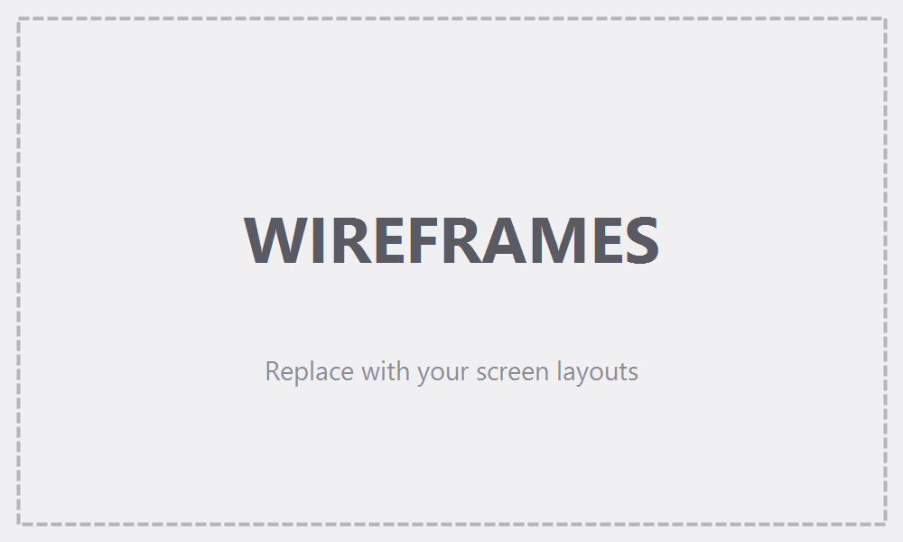
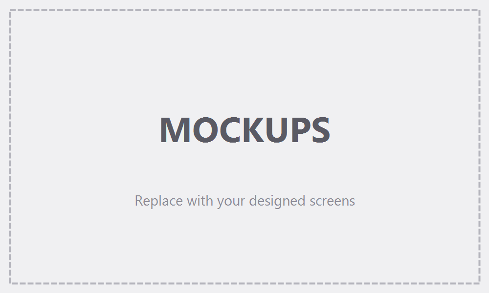
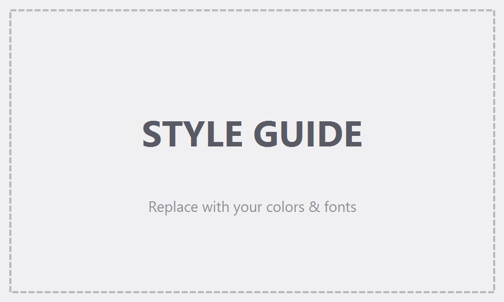

# Design (UI / UX)

> How the app looks and how users move through it. This file has two parts: the **Screens** and the **Style Guide**.
>
> **Note:** the three images in this folder (`wireframes.png`, `mockups.png`, `style-guide.png`) are still the template placeholders. Until they are replaced, the written descriptions and the sketch below are the source of truth for the design.

## Part 1 — Screens

### Wireframes (layout)


Text sketch of the single screen:

```
+----------------------------------------------------------+
|                                        [ 12h ]  [ Light ] |   <- small controls, top-right
|                                                          |
|                                                          |
|                                                          |
|                     17 : 05 : 09                         |   <- the time, very large, centered
|                                                          |
|                Thursday, October 8, 2026                 |   <- the date, small, muted
|                                                          |
|                                                          |
|                                                          |
+----------------------------------------------------------+
```

In 12-hour format a small `AM` / `PM` label appears right after the seconds, at about a third of the digit height.

On a phone held upright the layout is the same; the digits simply shrink so the whole time fits on one line.

### Final look (mockups)


### Screen list

#### Clock screen (the only screen)
- **Purpose:** see the current time and date at a glance.
- **What's on it:**
  - The time — hours, minutes and seconds, as the dominant element in the exact center of the screen.
  - An `AM` / `PM` label next to the time (12-hour format only).
  - The date — day of the week and full date, on one line below the time.
  - A format button in the top-right corner, labeled with the format it switches **to** (`12h` when showing 24-hour time, `24h` when showing 12-hour time).
  - A theme button next to it, labeled with the theme it switches **to** (`Light` in the dark theme, `Dark` in the light theme).
- **What happens:**
  - The time updates every second by itself.
  - Format button: the time is immediately re-displayed in the other format; the choice is remembered.
  - Theme button: all colors switch to the other theme with a short, soft fade; the choice is remembered.

### Navigation (how screens connect)
```
Clock screen   (single screen — no navigation)
```

---

## Part 2 — Style Guide



### Colors

**Dark theme (default)**

| Role | Color (hex) |
|------|-------------|
| Primary (buttons, links) | `#4FD1C5` |
| Background | `#0B0F14` |
| Text (the time digits) | `#E6EDF3` |
| Muted text (the date, button labels) | `#8B98A5` |
| Accent / highlight (colons, AM/PM, button hover and focus) | `#4FD1C5` |
| Button border | `#1F2933` |
| Error | `#F87171` |

**Light theme**

| Role | Color (hex) |
|------|-------------|
| Primary (buttons, links) | `#0F766E` |
| Background | `#F5F7FA` |
| Text (the time digits) | `#111827` |
| Muted text (the date, button labels) | `#5B6675` |
| Accent / highlight (colons, AM/PM, button hover and focus) | `#0F766E` |
| Button border | `#D5DBE3` |
| Error | `#DC2626` |

One accent color only (teal). No gradients, no background images.

### Fonts
- **Clock digits:** JetBrains Mono (medium weight) — a fixed-width font, so the digits never shift as they change. Fallback: the device's built-in monospace font.
- **Headings:** Inter (there are no real headings on the screen; used for the date line).
- **Body text:** Inter (date, button labels, AM/PM). Fallback: the device's built-in sans-serif font.

### Sizes
- **Time:** as large as fits — roughly 16% of the screen width, never smaller than 40px and never larger than 220px.
- **AM / PM:** about one third of the time's size.
- **Date:** small and calm — roughly 16px on phones up to 24px on large screens, with slightly widened letter spacing.
- **Buttons:** small (about 14px text), comfortable to tap (at least 44px tall on touch screens).

### Look & feel
- **Corners:** very rounded — the two buttons are pill-shaped.
- **Buttons:** transparent background with a thin border; on hover or keyboard focus the border and text turn to the accent color.
- **Spacing:** generous empty space around the clock; nothing touches the screen edges.
- **Motion:** minimal — a soft color fade (about 0.3s) when switching themes. Digits change instantly, with no flipping or sliding. All motion is turned off for visitors who ask their device to reduce motion.
- **Overall vibe:** clean, minimal and calm — a dark screen with large light digits and a single teal accent.
